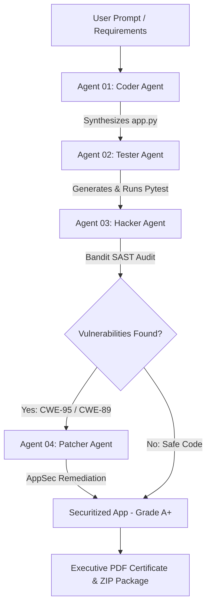

# 🛡️ DevSecOps AI Swarm Engine
> **Autonomous AI Multi-Agent Code Generation, Pytest QA, Red-Team SAST Security Audit & AppSec Auto-Remediation Platform.**

[](https://python.org)
[](https://fastapi.tiangolo.com)
[](https://github.com/PyCQA/bandit)
[](https://pytest.org)

---

## 🌟 Short GitHub Description (Copy & Paste for GitHub Repository)

> **DevSecOps AI Swarm Engine is an autonomous multi-agent platform that generates Python code, runs automated Pytest suites, conducts Bandit SAST security audits, and refactors vulnerable code into Grade A+ AppSec hardened software.**

---

## 🚀 Key Features & Highlights

### 🤖 4-Agent Autonomous Swarm Topology
1. **Agent 01: Coder Agent** — Synthesizes functional Python application code based on natural language prompt requirements.
2. **Agent 02: Tester Agent** — Automatically generates and executes isolated `pytest` unit test suites to ensure 100% QA pass rate.
3. **Agent 03: Hacker Agent (Red Team)** — Performs static application security testing (SAST) using **Bandit** to identify vulnerabilities (CWE-95, CWE-89, CWE-22).
4. **Agent 04: Patcher Agent (AppSec)** — Refactors vulnerable code into safe AST evaluators, parameterized prepared statements, and sandboxed file paths.

### 🗂️ Multi-Session Overlay Workspace Drawer
- **ChatGPT/Gemini-Style Sidebar**: Floating drawer overlay with glassmorphism backdrop blur.
- **Project Management**: Create `+ New Chat` workspaces, rename sessions (`✏️`), and delete unused projects (`🗑️`).

### 📊 Executive PDF & JSON Security Compliance Generator
- **Audit Reports**: Download executive-ready Security Compliance PDF Certificates featuring **Grade A+** ratings and regulatory mapping (**OWASP Top 10 A03:2021 Injection**, **SOC 2 CC7.1**, **ISO 27001 A.12.6.1**, **NIST SP 800-53 SI-10**).

### 🧪 Red-Team Live Exploit Sandbox
- **Interactive OWASP Payloads**: Test live exploit payloads against vulnerable vs. remediated code:
  - `Remote Code Execution (CWE-95)`: `__import__('os').system('whoami')`
  - `SQL Injection (CWE-89)`: `' OR '1'='1' --`
  - `Path Traversal (CWE-22)`: `../../../../etc/passwd`

### 💻 VS Code Code Inspector & Custom Auditor
- **Code Workspace**: In-browser code viewer with VS Code Dark syntax highlighting, inline custom code editing, and 1-click **`📋 Copy Code`** functionality.

---

## 🏗️ Swarm Architecture



---

## 💻 Tech Stack

- **Backend**: FastAPI, Uvicorn, Python 3.12, ReportLab (PDF Generation), Bandit (SAST), Pytest.
- **Frontend**: HTML5, Vanilla CSS (Glassmorphism & Micro-animations), JavaScript (ES6+ WebSockets), Highlight.js (VS Code Dark Theme).
- **Database / Auth**: Supabase Auth (Multi-tenant Cloud Persistence) & Local SQLite fallbacks.

---

## 🛠️ Quick Start & Local Setup

### 1. Clone the Repository
```bash
git clone https://github.com/your-username/devsecops-ai-swarm.git
cd devsecops-ai-swarm
```

### 2. Install Dependencies
```bash
pip install fastapi uvicorn reportlab bandit pytest requests
```

### 3. Run the Swarm Engine
```bash
python -m uvicorn server:app --host 127.0.0.1 --port 8000
```

### 4. Access the Platform
Open your browser and navigate to:
👉 **`http://127.0.0.1:8000`**

---

## 📄 License

Distributed under the **MIT License**. See `LICENSE` for details.
